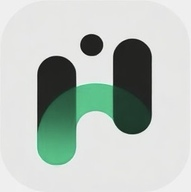
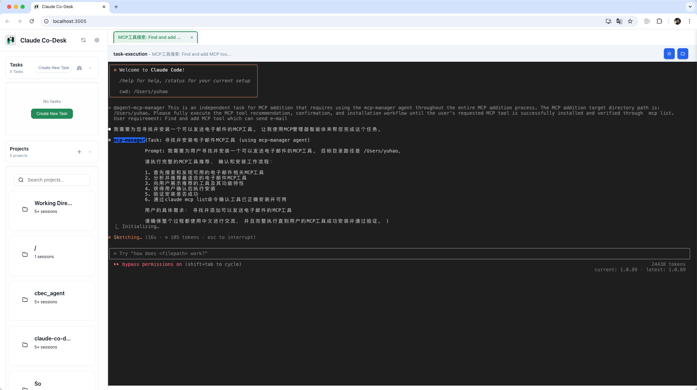
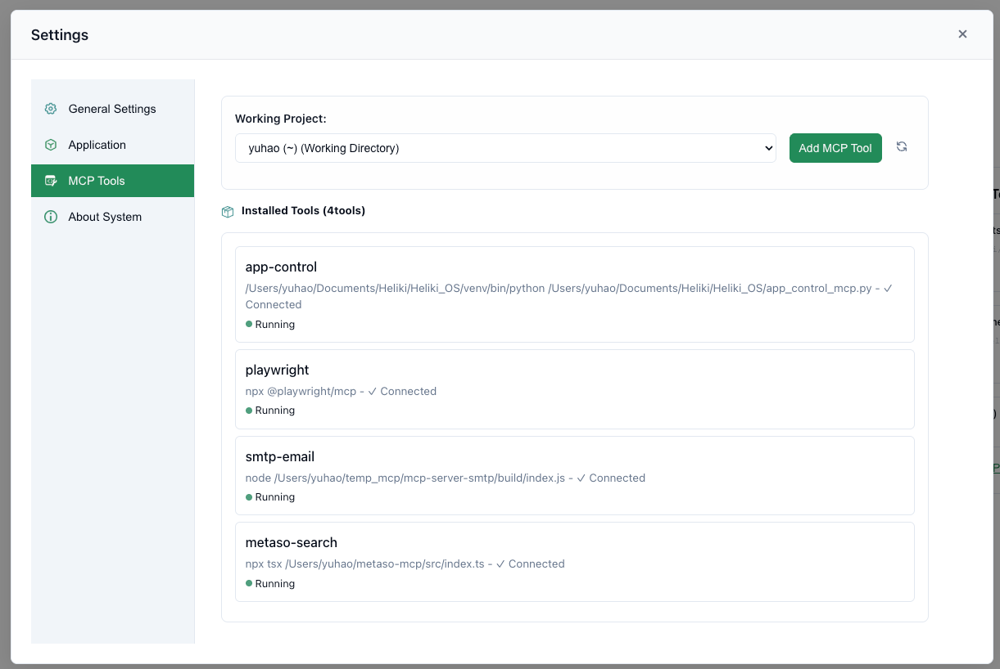
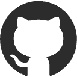

<div align="center">
  
  <h1>Claude Co-Desk</h1>
  <p>
    <a href="README_CN.md">中文</a>
  </p>
</div>

**Exploring the Limits of AI Agent System Resource Control**

Claude Co-Desk is a local AI task automation system built on Claude Code's complete context engineering framework. It pushes the boundaries of what AI agents can achieve when given full control over system resources, enabling unprecedented levels of automation through multi-agent collaboration.

## Screenshots

<div align="center">
  
<table>
<tr>
<td align="center">
<h3>AI Agent Dashboard</h3>

<br>
<em>Multi-agent collaboration control center</em>
</td>
<td align="center">
<h3>Task Execution</h3>

<br>
<em>Real-time AI agent task automation</em>
</td>
</tr>
<tr>
<td align="center">
<h3>MCP Tool Management</h3>

<br>
<em>Dynamic tool extension and management</em>
</td>
<td align="center">
<h3>Terminal Integration</h3>

<br>
<em>Seamless Claude Code CLI integration</em>
</td>
</tr>
</table>

</div>

## Vision

**Exploring the limits of AI Agent complete control over system resources for automation.**

Built on Claude Code's mature context engineering framework, Claude Co-Desk represents a new paradigm in AI automation - moving beyond simple code generation to true system-level task automation where AI agents can orchestrate complex workflows with near 100% completion rates.

## Core Features

- **System-Level Resource Control**: AI agents with comprehensive access to system resources
- **Multi-Agent Collaboration Platform**: Coordinated task execution across specialized agents
- **Dynamic Tool Extension**: Automatic MCP server discovery and integration
- **Context-Aware Automation**: Leveraging Claude Code's complete context framework

## Technical Architecture

- **Backend**: Python + FastAPI + WebSocket
- **Frontend**: Native HTML/CSS/JavaScript with modular components
- **Foundation**: Claude Code's context engineering framework
- **Protocol**: MCP (Model Context Protocol) for tool integration
- **License**: MIT License

## Quick Start

### Prerequisites

**1. Install Claude Code CLI**

Visit [claude.ai/code](https://claude.ai/code) and follow the official installation instructions for your platform.

**2. Verify Installation**
```bash
claude --version  # Should show version info
claude auth      # Follow prompts to authenticate
```

**3. Python Environment**
```bash
python --version  # Requires Python 3.8+
```

### Installation

1. Clone the repository:
```bash
git clone https://github.com/HammerGPT/claude-co-desk.git
cd claude-co-desk
```

2. Install dependencies:
```bash
pip install -r requirements.txt
```

3. Start the application:
```bash
python app.py
```

4. Open your browser and navigate to `http://localhost:3005`

## Key Differentiators

- **Beyond Traditional RPA**: AI agents that understand context and adapt to changing requirements
- **Complete System Access**: Agents can interact with files, networks, databases, and system resources
- **True Multi-Agent Collaboration**: Coordinated task execution with intelligent work distribution
- **MCP Protocol Integration**: Extensible tool ecosystem for unlimited capabilities
- **Local Privacy**: All processing happens locally, ensuring complete data privacy

## Development Status

Active development focusing on pushing the boundaries of AI agent automation capabilities.

## FAQ

### Why is this still Claude Code CLI mode instead of chat mode?
This tool aims to explore the limits of AI automated task execution. Chat mode is a nice-to-have feature that we may consider developing in the future.

## Feedback and Support

### Get in Touch

<div align="center">

<table>
<tr>
<td align="center" width="140">
<br>
<strong><a href="https://github.com/HammerGPT/claude-co-desk">GitHub</a></strong><br>
<sub>Feedback issues</sub>
</td>
<td align="center" width="140">
<br>
<strong><a href="https://x.com/GptHammer3309">Twitter/X</a></strong><br>
<sub>Updates & news</sub>
</td>
<td align="center" width="140">
<br>
<strong><a href="https://www.douyin.com/user/MS4wLjABAAAA3b9nQ5Ow1s0mOTERBjmQyVn0-WCvyT_FAK_LdMyVQuY">Douyin</a></strong><br>
<sub>Video content</sub>
</td>
<td align="center" width="140">
<br>
<strong>WeChat</strong><br>
</td>
</tr>
</table>

</div>

### Show Your Support
- Star this repository to show support
- Watch for updates and new releases  
- Follow the project for announcements

Thank you for your interest in Claude Co-Desk!

## License

MIT License - see the [LICENSE](LICENSE) file for details.