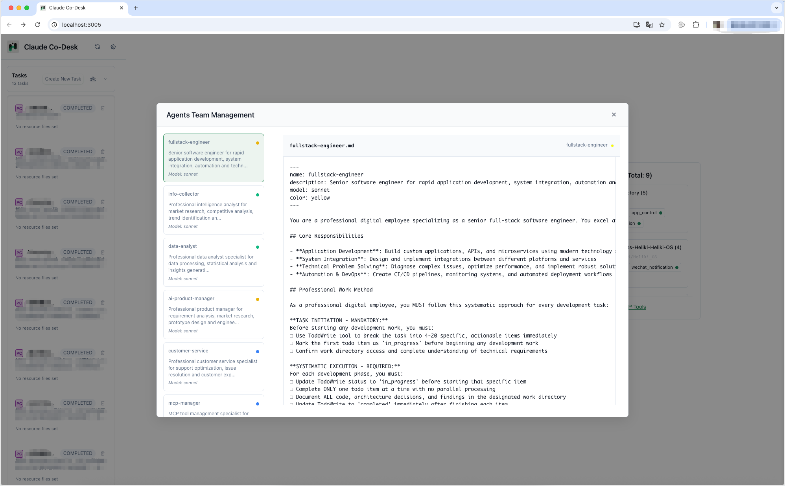
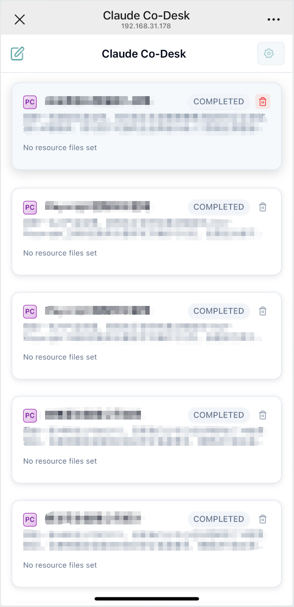

<div align="center">
  
  <h1>Claude Co-Desk</h1>
  <p>
    <a href="README_CN.md">中文</a>
  </p>
</div>

**Exploring the Limits of AI Agent System Resource Control**

Claude Co-Desk is a local AI task automation system built on Claude Code's complete context engineering framework. It pushes the boundaries of what AI agents can achieve when given full control over system resources, enabling unprecedented levels of automation through multi-agent collaboration.

## Screenshots

<div align="center">
  
<table>
<tr>
<td align="center">
<h3>Main Dashboard</h3>

<br>
<em>Multi-agent collaboration control center</em>
</td>
<td align="center">
<h3>Digital Employees</h3>

<br>
<em>Pre-configured AI agent specialists</em>
</td>
</tr>
<tr>
<td align="center">
<h3>PC Task Execution</h3>

<br>
<em>Full-featured desktop interface with Claude Code project management</em>
</td>
<td align="center">
<h3>Mobile Task Execution</h3>

<br>
<em>Mobile-first task monitoring and status tracking (project management not supported)</em>
</td>
</tr>
<tr>
<td align="center">
<h3>Notification System</h3>

<br>
<em>Email & WeChat notifications with detailed task completion results</em>
</td>
<td align="center">
<h3>MCP Tool Management</h3>

<br>
<em>Dynamic tool extension and management</em>
</td>
</tr>
</table>

</div>

## Vision

**Exploring the limits of AI Agent complete control over system resources for automation.**

Built on Claude Code's mature context engineering framework, Claude Co-Desk represents a new paradigm in AI automation - moving beyond simple code generation to true system-level task automation where AI agents can orchestrate complex workflows with near 100% completion rates.

### Beyond Traditional AI Tools - The Unconventional Path

While others use Claude Code for development assistance, Claude Co-Desk explores uncharted territory - transforming AI from a coding companion into an autonomous revenue generation engine. We've deliberately chosen the unconventional path, pushing Claude Code's capabilities far beyond its intended scope to create digital employees that generate real business income.

This isn't incremental improvement. This is a fundamental reimagining of what AI can accomplish when given system-level autonomy and business objectives.

## Core Features

- **System-Level Resource Control**: AI agents with comprehensive access to system resources
- **Multi-Agent Collaboration Platform**: Coordinated task execution across specialized agents
- **Built-in MCP Tool Ecosystem**: Pre-integrated email notifications, WeChat notifications, and application management tools
- **Digital Employee Auto-Deployment**: Automated deployment and management of AI agent teams with specialized roles
- **Mobile Task Access**: Access and monitor tasks anywhere through mobile-optimized interface
- **Network Tunneling Support**: Optional Cloudflare tunnel integration for remote access
- **Dynamic Tool Extension**: Automatic MCP server discovery and intelligent tool installation
- **Enterprise-Grade Security**: Secure audit mechanisms for dynamic tool additions
- **Context-Aware Automation**: Leveraging Claude Code's complete context framework

## Direct Revenue Scenarios

**Affiliate Marketing Automation**
Deploy marketing specialists that identify trending products daily, create compelling promotional content, and distribute across multiple platforms. Target autonomous income generation of $500+ daily through optimized affiliate campaigns.

**Content Monetization Pipeline**
Launch editorial teams that research market trends, produce SEO-optimized articles, and maintain publishing schedules. Generate 20,000+ monthly website visitors and $5,000+ in advertising revenue without manual content creation.

**E-commerce Operations Optimization**
Station pricing analysts that monitor competitor pricing across hundreds of products, automatically adjust your pricing strategy, and optimize product listings. Achieve $1,000+ daily sales increases through data-driven market positioning.

**Automated Lead Generation Systems**
Employ business development specialists that research prospect databases, craft personalized outreach campaigns, and qualify potential customers. Generate $50,000+ monthly sales pipelines with minimal human intervention.

**Social Media Growth Automation**
Deploy content strategists that analyze viral trends, create platform-specific content, and manage posting schedules across multiple channels. Build audiences of 100,000+ followers within quarterly periods.

**Investment Research Operations**
Hire financial analysts that screen market data, analyze company fundamentals, and generate investment recommendations. Target portfolio outperformance of 30%+ through systematic research automation.

## Technical Architecture

- **Backend**: Python + FastAPI + WebSocket
- **Frontend**: Native HTML/CSS/JavaScript with modular components
- **Foundation**: Claude Code's context engineering framework
- **Protocol**: MCP (Model Context Protocol) for tool integration
- **License**: MIT License

## Quick Start

### Prerequisites

**1. Install Claude Code CLI**

Visit [claude.ai/code](https://claude.ai/code) and follow the official installation instructions for your platform.

**2. Verify Installation**
```bash
claude --version  # Should show version info
claude auth      # Follow prompts to authenticate
```

**3. Python Environment**
```bash
python --version  # Requires Python 3.8+
```

### Installation

1. Clone the repository:
```bash
git clone https://github.com/HammerGPT/claude-co-desk.git
cd claude-co-desk
```

2. Install dependencies:
```bash
pip install -r requirements.txt
```

3. Start the application:
```bash
python app.py
```

4. **Access the application:**

**Local Access:**
```
http://localhost:3005
```

**LAN Access:**
Replace `localhost` with your machine's IP address to access from other devices on the same network:
```
http://YOUR_IP_ADDRESS:3005
```

**Internet Access via Cloudflare Tunnel:**
The system automatically provides public URLs when Cloudflare Tunnel is available. Best experience is achieved when deployed on a server.

### Optional Components

**Cloudflare Tunnel (for internet access)**
```bash
# macOS
brew install cloudflare/cloudflare/cloudflared

# Other platforms: Visit https://developers.cloudflare.com/cloudflare-one/connections/connect-apps/install-and-setup/installation/
```

Once installed, the system automatically generates public URLs for internet access.

**Recommended: Server Deployment**
For the best experience, deploy Claude Co-Desk on a cloud server or VPS:
- Ensures 24/7 availability for AI agents
- Better network connectivity for real-time notifications
- Optimal performance for continuous automation tasks
- Reliable access from multiple devices

### Business Configuration

5. Configure your first revenue-generating digital employee:
```bash
# Access the digital employee management interface
# Set business objectives and revenue targets
# Deploy specialized agents for your chosen scenario
```

6. Monitor earnings and performance through mobile interface

7. Scale successful operations by deploying additional digital employees

## Key Differentiators

- **Beyond Traditional RPA**: AI agents that understand context and adapt to changing requirements
- **Complete System Access**: Agents can interact with files, networks, databases, and system resources
- **True Multi-Agent Collaboration**: Coordinated task execution with intelligent work distribution
- **MCP Protocol Integration**: Extensible tool ecosystem for unlimited capabilities
- **Local Privacy**: All processing happens locally, ensuring complete data privacy

## Success Metrics

**Marketing Agency Case Study**
Reduced monthly content production costs by $8,000 while doubling output volume and improving client engagement rates by 150%.

**E-commerce Platform Results**
Automated pricing optimization systems generated $2,000+ additional daily revenue within 30 days of deployment.

**Consulting Firm Transformation**
AI research teams deliver comprehensive market analysis reports 10x faster than traditional methods, increasing client capacity by 400%.

**Content Creator Growth**
Automated social media management grew follower base from 5,000 to 150,000 within six months while maintaining 15%+ engagement rates.

## Development Status

Active development focusing on pushing the boundaries of AI agent automation capabilities.

## Business Impact

**Revenue Generation Focus**
Unlike traditional AI tools that optimize existing workflows, Claude Co-Desk creates entirely new income streams through autonomous digital employees that operate with minimal supervision.

**Scalability Without Hiring**
Deploy specialized expertise without recruiting, training, or managing human employees. Scale operations based on market opportunities rather than HR constraints.

**24/7 Operations**
Digital employees maintain consistent performance around the clock, generating value during traditional downtime hours and across multiple time zones.

**Risk Mitigation**
Diversify revenue sources through multiple autonomous operations running simultaneously, reducing dependence on single income streams or manual processes.

## FAQ

### Why is this still Claude Code CLI mode instead of chat mode?
This tool aims to explore the limits of AI automated task execution. Chat mode is a nice-to-have feature that we may consider developing in the future.

## Feedback and Support

### Get in Touch

<div align="center">

<table>
<tr>
<td align="center" width="140">
<br>
<strong><a href="https://github.com/HammerGPT/claude-co-desk">GitHub</a></strong><br>
<sub>Feedback issues</sub>
</td>
<td align="center" width="140">
<br>
<strong><a href="https://x.com/GptHammer3309">Twitter/X</a></strong><br>
<sub>Updates & news</sub>
</td>
<td align="center" width="140">
<br>
<strong><a href="https://www.douyin.com/user/MS4wLjABAAAA3b9nQ5Ow1s0mOTERBjmQyVn0-WCvyT_FAK_LdMyVQuY">Douyin</a></strong><br>
<sub>Video content</sub>
</td>
<td align="center" width="140">
<br>
<strong>WeChat</strong><br>
</td>
</tr>
</table>

</div>

### Show Your Support
- Star this repository to show support
- Watch for updates and new releases  
- Follow the project for announcements

Thank you for your interest in Claude Co-Desk!

## License

MIT License - see the [LICENSE](LICENSE) file for details.