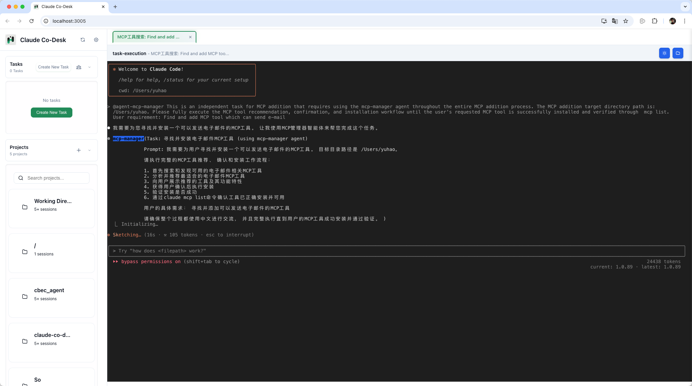
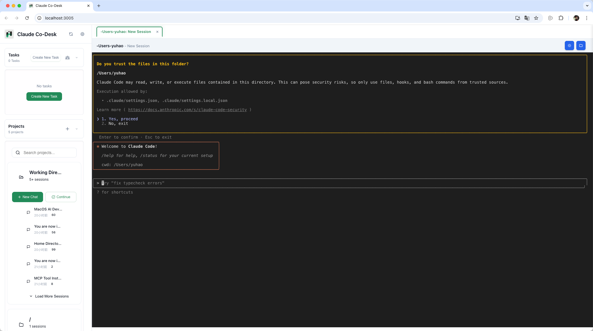

<div align="center">
  
  <h1>Claude Co-Desk</h1>
</div>

**探索AI Agent完全掌控系统资源能达到的自动化的极限**

Claude Co-Desk 是基于Claude Code完整上下文工程框架构建的本地AI任务自动化系统。它突破传统AI工具的边界，让AI智能体获得系统级资源控制能力，通过多智能体协作实现前所未有的自动化水平。

## 功能演示

<div align="center">
  
<table>
<tr>
<td align="center">
<h3>AI智能体控制台</h3>

<br>
<em>多智能体协作控制中心</em>
</td>
<td align="center">
<h3>任务执行界面</h3>

<br>
<em>实时AI智能体任务自动化</em>
</td>
</tr>
<tr>
<td align="center">
<h3>MCP工具管理</h3>

<br>
<em>动态工具扩展和管理</em>
</td>
<td align="center">
<h3>终端集成</h3>

<br>
<em>无缝Claude Code CLI集成</em>
</td>
</tr>
</table>

</div>

## 愿景

**探索AI Agent完全掌控系统资源能达到的自动化的极限**

基于Claude Code成熟的上下文工程框架，Claude Co-Desk代表了AI自动化的新范式——从简单的代码生成跃升至真正的系统级任务自动化，AI智能体能够协调复杂工作流程，实现接近100%的任务完成率。

## 核心特性

- **系统级资源控制**：AI智能体拥有对系统资源的全面访问权限
- **多智能体协作平台**：专业化智能体间的协调任务执行
- **动态工具扩展**：自动MCP服务器发现和集成
- **上下文感知自动化**：充分利用Claude Code完整上下文框架

## 技术架构

- **后端**：Python + FastAPI + WebSocket
- **前端**：原生HTML/CSS/JavaScript模块化组件
- **技术基础**：Claude Code上下文工程框架
- **协议标准**：MCP（模型上下文协议）工具集成
- **开源许可**：MIT License

## 快速开始

### 前置条件

**1. 安装Claude Code CLI**

访问 [claude.ai/code](https://claude.ai/code) 并按照官方安装说明为您的平台安装Claude Code CLI。

**2. 验证安装**
```bash
claude --version  # 显示版本信息
claude auth      # 按提示进行身份验证
```

**3. Python环境**
```bash
python --version  # 需要Python 3.8+
```

### 安装步骤

1. 克隆仓库：
```bash
git clone https://github.com/HammerGPT/claude-co-desk.git
cd claude-co-desk
```

2. 安装依赖：
```bash
pip install -r requirements.txt
```

3. 启动应用：
```bash
python app.py
```

4. 在浏览器中访问 `http://localhost:3005`

## 核心优势

- **超越传统RPA**：理解上下文并适应不断变化需求的AI智能体
- **完整系统访问**：智能体可与文件、网络、数据库和系统资源交互
- **真正的多智能体协作**：智能工作分配的协调任务执行
- **MCP协议集成**：无限扩展能力的工具生态系统
- **本地隐私保护**：所有处理都在本地进行，确保完整数据隐私

## 开发状态

正在积极开发中，专注于推动AI智能体自动化能力的边界。

## 常见问题

### 为什么还是Claude Code CLI模式而没有对话模式？
这个工具旨在探索AI自动化任务执行的极限。对话模式是一个锦上添花的功能，未来会考虑开发。

## 反馈与支持

### 联系我们

<div align="center">

<table>
<tr>
<td align="center" width="140">
<br>
<strong><a href="https://github.com/HammerGPT/claude-co-desk">GitHub</a></strong><br>
<sub>源码与问题反馈</sub>
</td>
<td align="center" width="140">
<br>
<strong><a href="https://x.com/GptHammer3309">Twitter/X</a></strong><br>
<sub>更新与资讯</sub>
</td>
<td align="center" width="140">
<br>
<strong><a href="https://www.douyin.com/user/MS4wLjABAAAA3b9nQ5Ow1s0mOTERBjmQyVn0-WCvyT_FAK_LdMyVQuY">抖音</a></strong><br>
<sub>视频内容</sub>
</td>
<td align="center" width="140">
<br>
<strong>微信</strong><br>
<sub>扫码联系</sub>
</td>
</tr>
</table>

</div>

### 支持我们
- 为这个仓库点Star表示支持
- 关注获取更新和新版本发布信息
- 关注项目获取公告信息

感谢您对Claude Co-Desk的关注！

## 许可证

MIT License - 详见 [LICENSE](LICENSE) 文件。