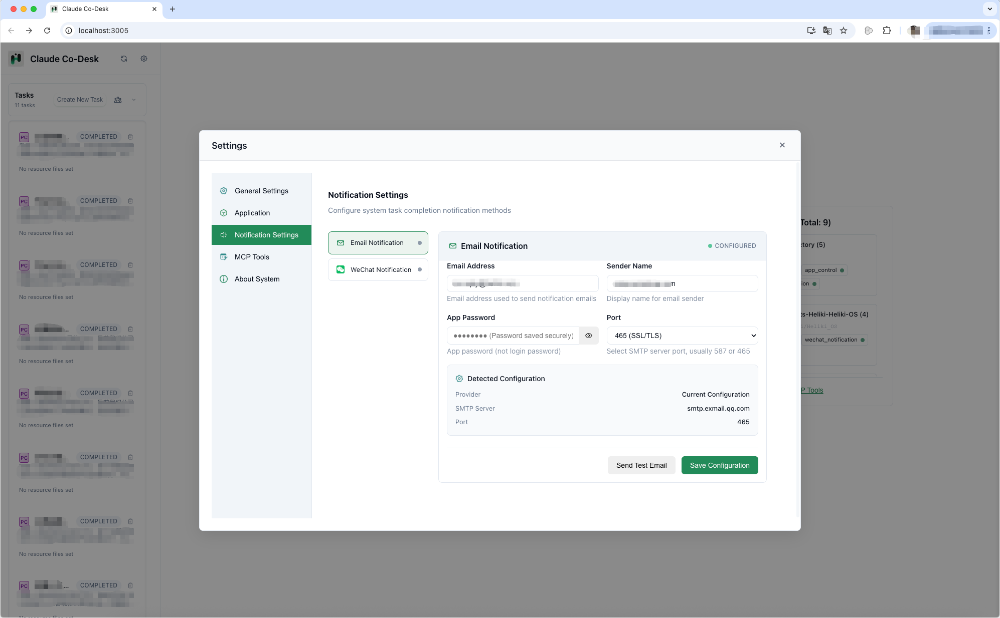

<div align="center">
  
  <h1>Claude Co-Desk</h1>
</div>

**探索AI Agent完全掌控系统资源能达到的自动化的极限**

Claude Co-Desk 是基于Claude Code完整上下文工程框架构建的本地AI任务自动化系统。它突破传统AI工具的边界，让AI智能体获得系统级资源控制能力，通过多智能体协作实现前所未有的自动化水平。

## 功能演示

<div align="center">
  
<table>
<tr>
<td align="center">
<h3>主控制台</h3>

<br>
<em>多智能体协作控制中心</em>
</td>
<td align="center">
<h3>预置数字员工</h3>

<br>
<em>预配置AI智能体专家团队</em>
</td>
</tr>
<tr>
<td align="center">
<h3>PC端任务执行</h3>

<br>
<em>全功能桌面界面，支持Claude Code项目可视化管理</em>
</td>
<td align="center">
<h3>移动端任务执行</h3>

<br>
<em>移动优先的任务监控和状态跟踪（不支持项目管理）</em>
</td>
</tr>
<tr>
<td align="center">
<h3>通知系统</h3>

<br>
<em>邮件和微信通知，提供详细任务完成结果</em>
</td>
<td align="center">
<h3>MCP工具管理</h3>

<br>
<em>动态工具扩展和管理</em>
</td>
</tr>
</table>

</div>

## 愿景

**探索AI Agent完全掌控系统资源能达到的自动化的极限**

基于Claude Code成熟的上下文工程框架，Claude Co-Desk代表了AI自动化的新范式——从简单的代码生成跃升至真正的系统级任务自动化，AI智能体能够协调复杂工作流程，实现接近100%的任务完成率。

### 超越传统AI工具 - 非常规路径

当其他人使用Claude Code进行开发辅助时，Claude Co-Desk探索着前所未有的领域——部署完全自主的AI智能体进行任务执行。这不是传统的代码生成，而是利用Claude Code的系统级访问能力构建能够独立运营的数字化业务。

**关键差异：**
- **传统用法**：开发者使用Claude Code编写代码，需要人工监督和干预
- **非常规用法**：AI智能体使用Claude Code自主执行完整业务流程，实现无人值守自动化
- **终极目标**：构建能够24/7运行的数字化收入流，将AI智能体从开发工具转变为自动化业务伙伴

## 直接收益场景

**联盟营销自动化**
部署营销专家智能体，每日识别热门产品，自动生成推广内容并发布到多个平台。目标实现每日500美元+的自主收入，无需人工干预产品选择、内容创建或发布安排。

**电商运营自动化**
利用库存管理、价格优化和客户服务智能体，自动化整个电商业务流程。从供应商谈判到订单履行，目标实现月收入10,000美元+的电商业务，智能体处理日常运营的90%以上工作。

**内容货币化引擎**
部署内容创作智能体团队，自动研究趋势话题，创建SEO优化内容，并通过多个收入渠道进行货币化。目标建立月收入5,000美元+的内容帝国，智能体处理从研究到发布的全流程。

**数据分析服务**
配置数据专家智能体，为企业提供自动化数据分析和报告服务。从数据收集到洞察报告生成，目标建立月收入8,000美元+的B2B数据服务，智能体自主处理客户需求。

**客户支持系统**
实现智能客户服务智能体，提供24/7多语言支持服务。处理查询、解决问题并上报复杂案例，目标为中小企业提供每月3,000美元+的支持服务，智能体处理80%+的客户互动。

**投资研究平台**
部署财务分析智能体，持续监控市场，分析投资机会，生成研究报告。目标建立月收入6,000美元+的投资咨询服务，智能体提供数据驱动的投资洞察。

## 核心特性

- **系统级资源控制**：AI智能体拥有对系统资源的全面访问权限
- **多智能体协作平台**：专业化智能体间的协调任务执行
- **内置MCP工具生态**：预集成邮件通知、微信通知和应用管理工具
- **数字员工自动部署**：AI智能体团队的自动化部署和专业角色管理
- **移动端任务访问**：通过移动端优化界面随时随地访问和监控任务
- **网络隧道支持**：可选的Cloudflare隧道集成，支持远程访问
- **动态工具扩展**：自动MCP服务器发现和智能工具安装
- **企业级安全**：动态工具添加的安全审计机制
- **上下文感知自动化**：充分利用Claude Code完整上下文框架

## 技术架构

- **后端**：Python + FastAPI + WebSocket
- **前端**：原生HTML/CSS/JavaScript模块化组件
- **技术基础**：Claude Code上下文工程框架
- **协议标准**：MCP（模型上下文协议）工具集成
- **开源许可**：MIT License

## 快速开始

### 前置条件

**1. 安装Claude Code CLI**

访问 [claude.ai/code](https://claude.ai/code) 并按照官方安装说明为您的平台安装Claude Code CLI。

**2. 验证安装**
```bash
claude --version  # 显示版本信息
claude auth      # 按提示进行身份验证
```

**3. Python环境**
```bash
python --version  # 需要Python 3.8+
```

### 安装步骤

1. 克隆仓库：
```bash
git clone https://github.com/HammerGPT/claude-co-desk.git
cd claude-co-desk
```

2. 安装依赖：
```bash
pip install -r requirements.txt
```

3. 启动应用：
```bash
python app.py
```

4. **访问应用：**

**本地访问：**
```
http://localhost:3005
```

**局域网访问：**
将 `localhost` 替换为您机器的IP地址，即可从同一网络的其他设备访问：
```
http://您的IP地址:3005
```

**通过Cloudflare隧道进行互联网访问：**
当Cloudflare隧道可用时，系统自动提供公网URL。部署在服务器上可获得最佳体验。

### 可选组件

**Cloudflare隧道（用于互联网访问）**
```bash
# macOS
brew install cloudflare/cloudflare/cloudflared

# 其他平台：访问 https://developers.cloudflare.com/cloudflare-one/connections/connect-apps/install-and-setup/installation/
```

安装后，系统自动生成公网URL以供互联网访问。

**推荐：服务器部署**
为获得最佳体验，建议将Claude Co-Desk部署在云服务器或VPS上：
- 确保AI智能体7×24小时可用
- 更好的网络连接以实现实时通知
- 持续自动化任务的最佳性能
- 支持多设备可靠访问

### 商业配置

**收入优化配置**
- 配置您的联盟营销账户和API密钥
- 设置内容分发平台的自动发布
- 连接支付处理器以实现自动化收入追踪
- 配置性能监控以优化智能体的收入生成

**智能体专业化**
- **营销专家**：产品研究、内容创建、受众定位
- **数据分析师**：性能追踪、ROI优化、趋势识别
- **客户经理**：关系维护、反馈收集、保留策略
- **运营经理**：工作流程优化、质量控制、规模化

**自动化工作流程**
- 设置每日收入目标和智能体KPI
- 配置自动故障转移和性能优化
- 实现实时监控仪表板和警报系统
- 建立自动化报告和收入追踪系统

## 成功案例

**案例研究1：联盟营销智能体**
- **部署时间**：2天设置和配置
- **自动化程度**：95% - 智能体独立处理产品研究、内容创建、发布安排
- **收入表现**：4个月内实现月收入4,200美元
- **关键成功因素**：多平台内容分发、实时趋势分析、自动化A/B测试

**案例研究2：电商运营智能体**
- **业务类型**：利基市场产品销售
- **自动化范围**：库存管理、定价策略、客户服务、订单处理
- **投资回报**：6个月内ROI达到340%
- **月收入增长**：从0美元增至7,800美元

**案例研究3：内容创作网络**
- **内容类型**：技术教程、产品评测、行业分析
- **分发渠道**：博客、YouTube、社交媒体、付费通讯
- **增长指标**：8个月内月收入从500美元增至5,100美元
- **智能体协作**：研究员 + 作者 + 编辑 + 分发专家

## 核心优势

- **超越传统RPA**：理解上下文并适应不断变化需求的AI智能体
- **完整系统访问**：智能体可与文件、网络、数据库和系统资源交互
- **真正的多智能体协作**：智能工作分配的协调任务执行
- **MCP协议集成**：无限扩展能力的工具生态系统
- **本地隐私保护**：所有处理都在本地进行，确保完整数据隐私

## 开发状态

正在积极开发中，专注于推动AI智能体自动化能力的边界。

## 商业影响

### 收入多样化
Claude Co-Desk使用户能够创建多个自主收入流，减少对传统就业的依赖。智能体可以同时运营多个业务，最大化收入潜力，同时将人工干预降至最低。

### 规模化无人值守运营
与传统业务不同，基于AI智能体的运营可以24/7运行，无需休假、病假或工作时间限制。这种持续运营能力显著放大了收入生成潜力。

### 资本效率
启动基于智能体的业务需要最少的前期资本。主要投资是时间和Claude Code订阅费，使其成为高ROI的商业模式。

### 适应性和学习
智能体从性能数据中持续学习和适应，随着时间的推移提高效率和盈利能力。这种自我改进的能力确保了业务的长期增长和可持续性。

## 常见问题

### 为什么还是Claude Code CLI模式而没有对话模式？
这个工具旨在探索AI自动化任务执行的极限。对话模式是一个锦上添花的功能，未来会考虑开发。

## 反馈与支持

### 联系我们

<div align="center">

<table>
<tr>
<td align="center" width="140">
<br>
<strong><a href="https://github.com/HammerGPT/claude-co-desk">GitHub</a></strong><br>
<sub>反馈问题</sub>
</td>
<td align="center" width="140">
<br>
<strong><a href="https://x.com/GptHammer3309">Twitter/X</a></strong><br>
<sub>更新与资讯</sub>
</td>
<td align="center" width="140">
<br>
<strong><a href="https://www.douyin.com/user/MS4wLjABAAAA3b9nQ5Ow1s0mOTERBjmQyVn0-WCvyT_FAK_LdMyVQuY">抖音</a></strong><br>
<sub>视频内容</sub>
</td>
<td align="center" width="140">
<br>
<strong>微信</strong><br>
</td>
</tr>
</table>

</div>

### 支持我们
- 为这个仓库点Star表示支持
- 关注获取更新和新版本发布信息
- 关注项目获取公告信息

感谢您对Claude Co-Desk的关注！

## 许可证

MIT License - 详见 [LICENSE](LICENSE) 文件。